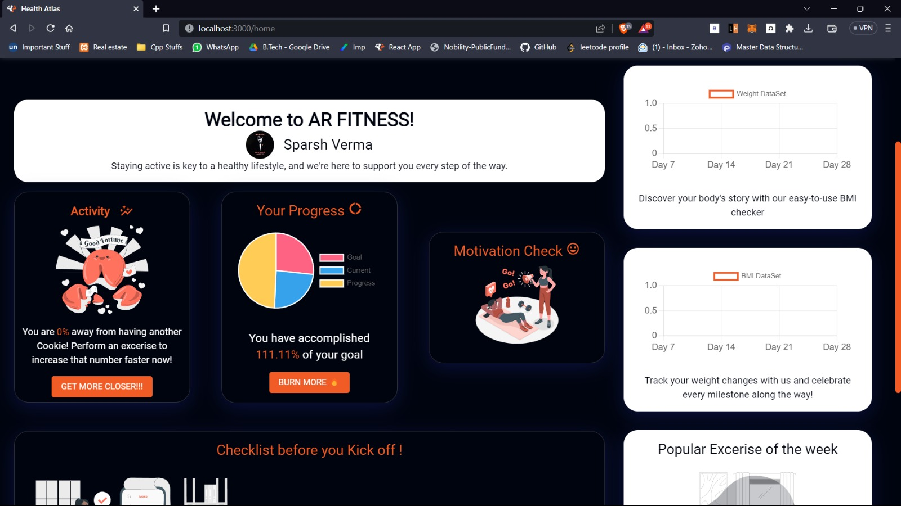
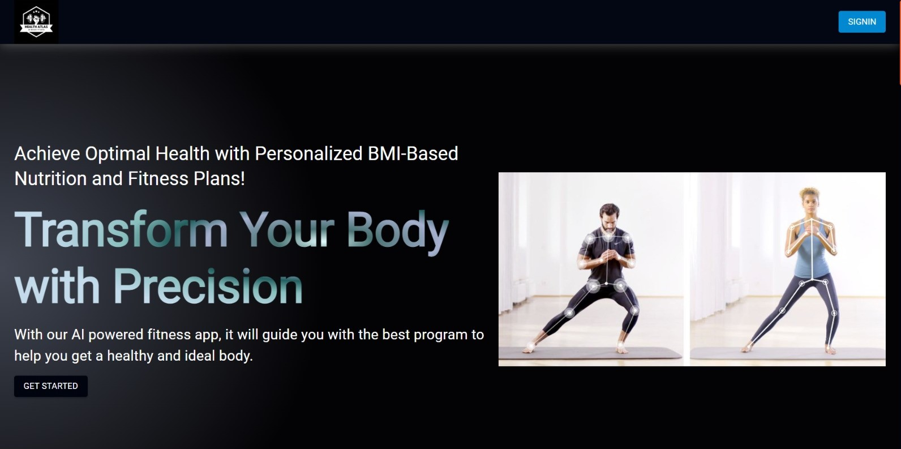
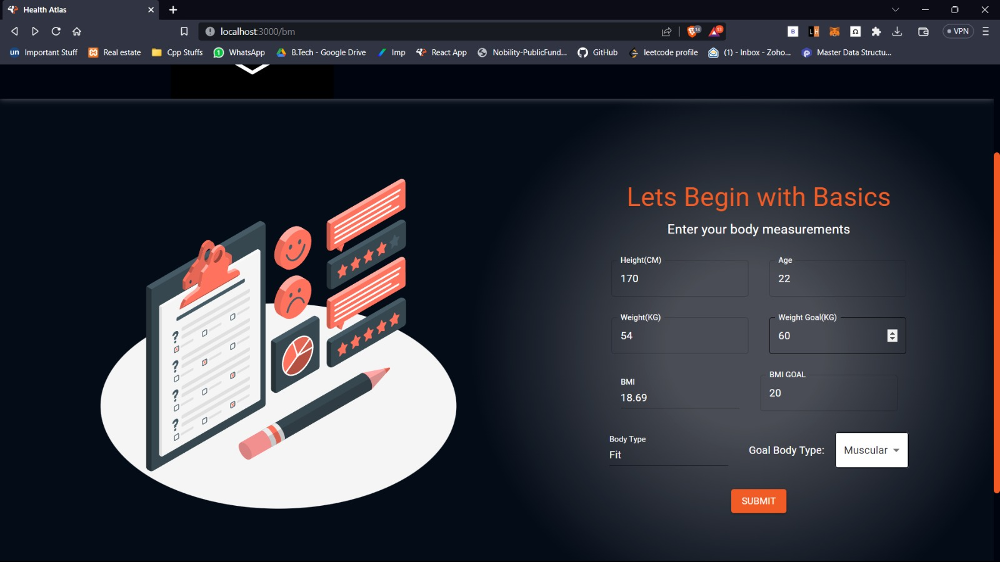
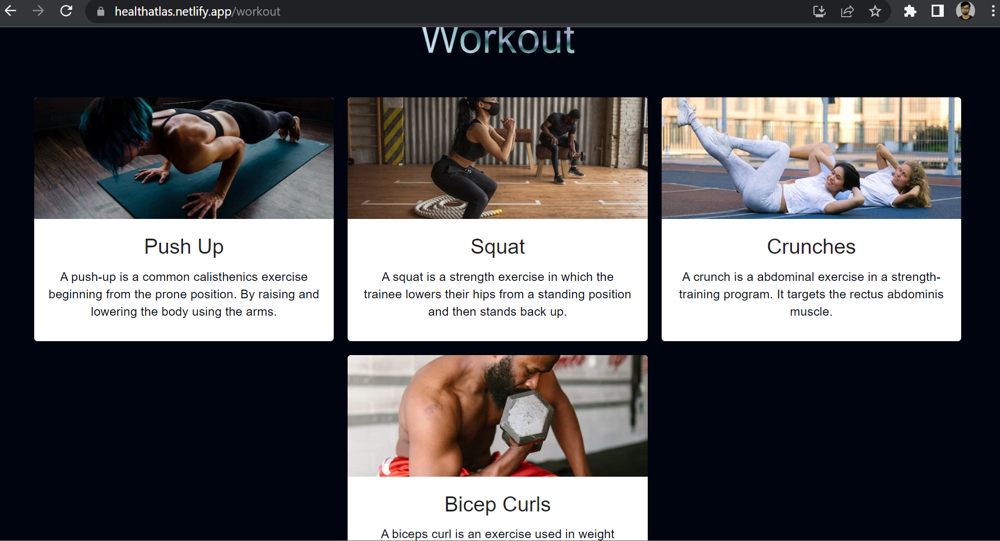
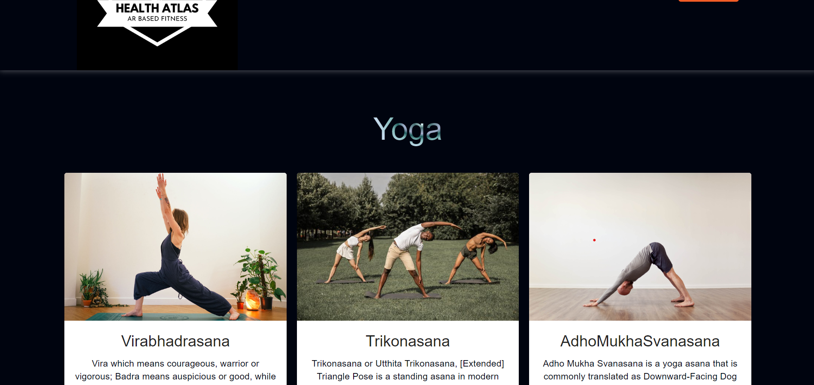

# HealthAtlas with AR(HealthAtlas with AR )

## Authors

- [@sparshrex](https://github.com/sparshrex)
- [@tryamb](https://github.com/tryamb)

## Project installtion guide
**Project Documentation: Health Atlas**

**Introduction:**
Health Atlas is a web application built using React.js, which aims to provide users with accurate feedback on their exercise posture and technique. The app incorporates an augmented reality feature that visualizes the correct form for each exercise, helping users maintain proper alignment and reduce the risk of injuries. Additionally, the app offers personalized diet recommendations based on user preferences and goals. The project utilizes Firebase for authentication and is deployed on Netlify for seamless access.

**Installation:**
Follow the steps below to set up and run the Health Atlas app on your local development environment:

1. Clone the GitHub repository:
   ```
   git clone https://github.com/your-username/HealthAtlaswithAR.git
   ```

2. Install project dependencies:
   ```
   npm install
   ```

3. Configure Firebase for Authentication:
   - Create a Firebase project at https://firebase.google.com/.
   - Obtain the Firebase configuration credentials (apiKey, authDomain, etc.).
   - Replace the Firebase config object in the project's `src/firebase/firebase.js` file with your credentials.

**Firebase Authentication:**
Health Atlas uses Firebase for user authentication, providing a secure and seamless login experience. Users can sign up, log in, and recover their passwords through Firebase's authentication services.

**Augmented Reality Feature:**
The app's core feature is the real-time posture and technique feedback, enhanced by an augmented reality visualization. By utilizing PoseNet or a similar pose estimation library, the app tracks the user's body movements during exercise. The augmented reality feature overlays a line on the user's body pose, visually guiding them to maintain correct form.

**Personalized Diet Recommendations:**
To offer personalized diet recommendations, the app collects user data on their fitness goals, body type, and dietary preferences. It then utilizes this data to generate tailored nutritional advice, promoting healthy eating habits and supporting users' fitness journeys.

**Deployment on Netlify:**
Health Atlas is deployed on Netlify, ensuring fast and reliable access for users. The continuous deployment pipeline is set up to automatically deploy changes from the main branch.

**Usage:**
1. Sign up or log in to access the Health Atlas app.
2. Choose an exercise from the available options and start performing it.
3. Observe the real-time feedback on your posture and technique.
4. Benefit from the augmented reality feature, which visually guides you in maintaining correct form.
5. Explore personalized diet recommendations based on your fitness goals and preferences.

**Conclusion:**
Health Atlas is an innovative and engaging solution that addresses common fitness challenges. By providing users with accurate form guidance during exercises, personalized diet recommendations, and progress tracking, the app promotes safer workouts, better nutrition, and overall improved health and fitness. With Firebase authentication and Netlify deployment, Health Atlas ensures a seamless and secure user experience.

Content of Read Md file:

- Abstract
- Tech Stack
- Features


## Demo Link 
-[https://healthatlas.netlify.app/](https://healthatlas.netlify.app/)


## Abstract

- Augmented Reality (AR) technology for an immersive and interactive experience
- Selection of workout programs based on different goals and fitness levels
- Tracking of your progress and workout history
- Personalized feedback and guidance to improve your technique and performance
- PWA optimal viewing on different devices

# Front-End

- React, a popular front-end framework, to build our user interface in a modular and scalable way. React's component-based architecture makes it easy for us to manage the various elements of our UI, and its virtual DOM ensures that our application is highly performant.
- Material UI is a popular React component library that provides pre-built and customizable UI components following Google's Material Design guidelines. These components can be used to build beautiful and responsive user interfaces with ease.

# Back-End

## Firebase:

Firebase is a cloud-based platform that provides a range of services and tools for building and managing web and mobile applications. Some of the key features of Firebase include:

- Realtime Database: a NoSQL database that allows you to store and sync data in real-time across multiple clients.
- Authentication: a service that allows you to easily add user authentication and identity management to your app.
- Hosting: a service that allows you to deploy and serve your web app with a scalable and secure hosting solution.

## Mediapipe

- Mediapipe is an open-source framework developed by Google that provides tools for building real-time computer vision applications.
- We chose to use Mediapipe specifically for its pose detection capabilities, which allow us to accurately estimate the positions of 33 key body landmarks in real time.


## Screenshots

1. Dashboard:
   

2. Diet:
   

3. Home:
   

4. Measure:
   

5. Workout:
   

6. Yoga:
   


